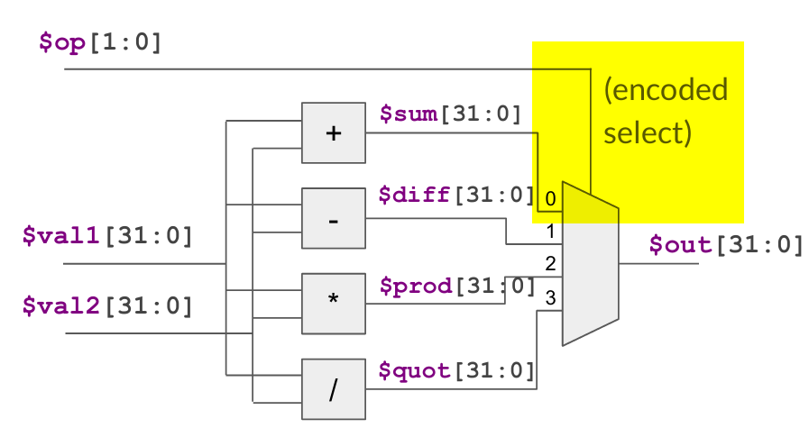
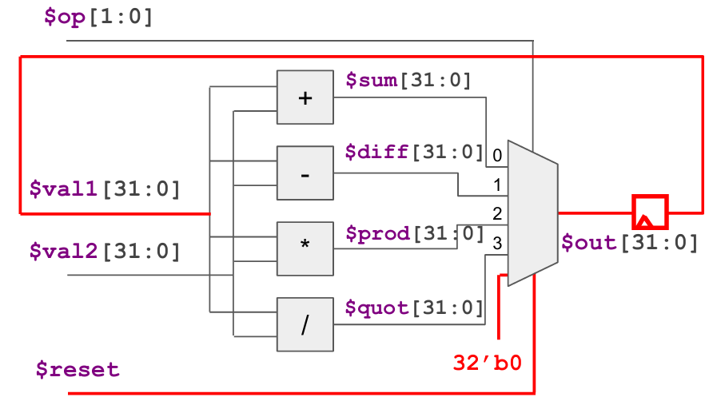
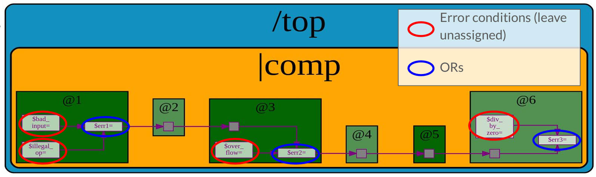
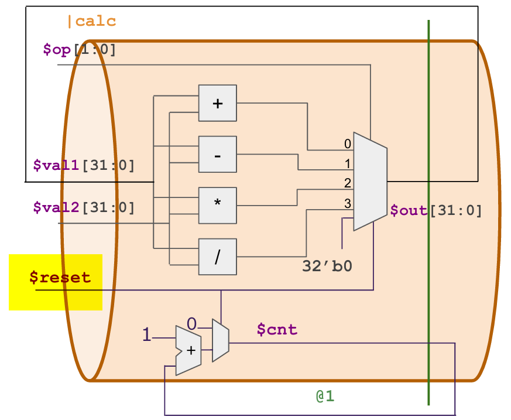
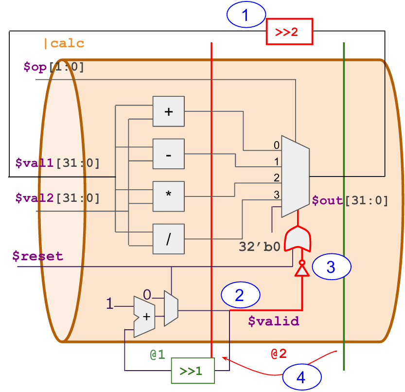
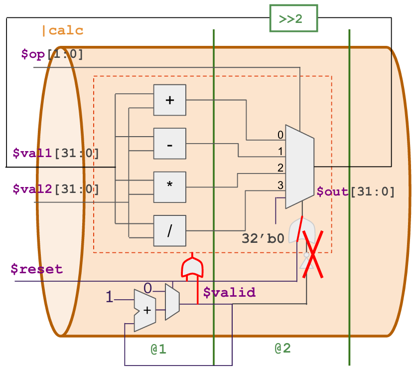

# RISC-V_MYTH_Workshop - TL Verilog Labs
The labs purpose is to understand TL-verilog and develop digital logic in this language. The labs are implemented on [Makerchip platform](https://makerchip.com/sandbox/#). My solutions to the labs as part of the workshop:
1. [lab_01_comb_logic_design](./lab_01_comb_logic_design.v) - 
   - Combinational design using TL-Verilog.
   - The design includes basic logic gates, vector signals and mux implementation in TL-verilog.
2. [lab_02_combinational_calculator](./lab_02_combinational_calculator.v) - 
   - Implements the combinational calculator as illustrated in this block diagram:
   
3. [lab_03_sequential_counters](./lab_03_sequential_counters.v) -
   - Implements a free running counter and a fibonacci sequence generator circuits in TL-verilog.
4. [lab_04_sequential_calculator](./lab_04_sequential_calculator.v) -
   - Implements the sequential version of the combinational calculator designed as part of the lab 02.
   - The block diagram is as follows:
   
5. [lab_05_reproduce_pipeline_error](./lab_05_reproduce_pipeline_error.v) -
   - This lab focuses on getting started with pipelines in TL-Verilog.
   - The pipelined hardware as illustrated in the figure below is designed as part of this lab.
   
6. [lab_06_pipeline_calc_counter](./lab_06_pipeline_calc_counter.v) -
   - This design focuses on designing a pipeline having two hardware modules:
      - Sequential calculator designed in lab 04.
	  - Sequential counter designed in lab 03.
   - The block design is as follows:
   
7. [lab_07_2cycle_calculator](./lab_07_2cycle_calculator.v) -
   - Implements a pipelined version of the sequential calculator. This calculator computes the results in 2 clock cycles.
   - The design is illustrated in this figure below:
   
8. [lab_08_2cycle_calculator_with_validity](./lab_08_2cycle_calculator_with_validity.png) -
   - This lab builds on top of the lab 07. The design introduces a valid signal to indicate the validity of the computation.
   - This lab also introduces the validity concept in TL-verilog. The design is illustrated below:
   